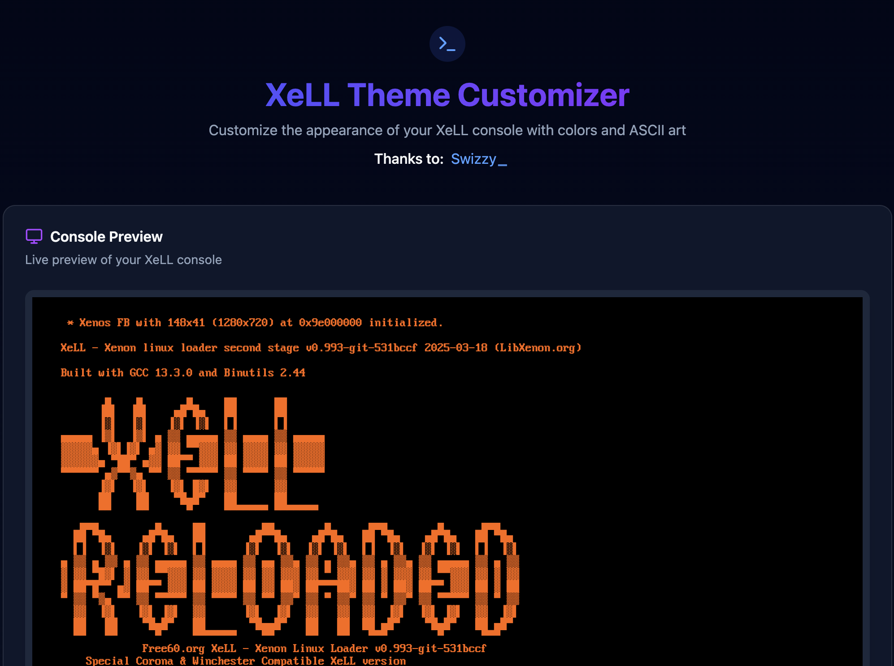

# XeLL Theme Customizer

  

    
  

A web application that allows you to customize the appearance of XeLL (Xenon Linux Loader) by changing colors and ASCII art, then generate a custom XeLL build.

## Project Repositories

- [barrenechea/xell-customizer](https://github.com/barrenechea/xell-customizer) (this repo): The main web application that allows you to customize XeLL
- [barrenechea/xell-customizer-api](https://github.com/barrenechea/xell-customizer-api): A simple interface between the web application and xell-reloaded's build system
- [barrenechea/xell-reloaded](https://github.com/barrenechea/xell-reloaded): The actual XeLL source code. Builds are triggered here via GitHub Actions
- [barrenechea/libxenon](https://github.com/barrenechea/libxenon): The library that XeLL is built on top of

## Contributing

Contributions are welcome! Please feel free to submit a Pull Request.

## License

This project is licensed under the GNU General Public License v3.0. See the [LICENSE](LICENSE) file for details.
